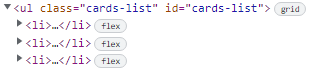
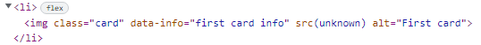
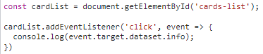
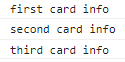

### bubbling-capturing-dataset
### Как передать информацию о выборе карты в ваш js? 
:eyes: [деплой примера](https://redvoxdev.github.io/howto/) :point_left: - информация о выборе выводится в консоль

#### Пояснения:

Пример основан на всплытии и погружении событий ([подробнее](https://learn.javascript.ru/bubbling-and-capturing))

Вам не нужно вешать обработчик события на каждый элемент, достаточно повесить его на общего родителя всех этих элементов, например, родителем для элементов **li** будет **ul**.



А сами данные можно передать через атрибут начинающийся на **data-** ([подробнее](https://learn.javascript.ru/dom-attributes-and-properties#nestandartnye-atributy-dataset))



Просто добавляем элементу артрибут начинающийся на **data-**, на картинке выше мы добавляем **info** к **data-** и получем **data-info**, в кавычках мы указываем данные которые хотим использовать в js, на картинке выше это **"first card info"**.



В js мы вешаем обработчик событий на список **ul** (**cardList** на картинке), и получем через **event.target** данные из свойства **dataset** (на картинке `event.target.dataset.info`)



В консоли по клику на карту мы увидим данные из свойства dataset атрибута (на картинке выше)

#### PS: 
Можно задавать dataset элемента число-индекс, которое потом использовать как индекс для доступа к элементу массива. 

**html**:
```
data-id="1"
``` 
**js**:
```
cards[event.target.dataset.id]
```


### random-card-from-deck
### Как доставать рандомную карту из колоды?

На самом деле доставать рандомные карты не нужно, достаточно перемешать колоду, а потом доставать карты по порядку, например, методом массива **pop()** ([подробнее](https://developer.mozilla.org/ru/docs/Web/JavaScript/Reference/Global_Objects/Array/pop)), он вернет нам последнюю карту (элемент массива), и удалит её из колоды (массива).

Ниже приведены примеры функции для перемешивания колоды:

```javascript
const shuffle = (deck) => deck.sort(() => Math.random() - 0.5);
```

Функция выше основана на том, как работает метод **sort()** для массивов. Если коротко, два элемента в массиве поменяются местами, если функция внутри **sort()** вернет отрицательный результат. **Math.random()** возвращает псевдослучайное число с плавающей запятой из диапазона от 0 до 1, не включая единицу. Таким образом, если число которое вернет **Math.random()** будет меньше 0.5, то мы получим отрицательный результат и два элемента массива поменяются местами.

```javascript
const shuffle = (deck) => {
  for (let i = deck.length - 1; i > 0; i--) {
    const j = Math.floor(Math.random() * (i + 1));
    const temp = deck[i];
    deck[i] = deck[j];
    deck[j] = temp;
  }
  return deck;
}
```
Вторая функция более длинная и чаще перемешивает лучше первой. Основана она на методе Фишера-Ейтса ([подробнее](https://ru.wikipedia.org/wiki/%D0%A2%D0%B0%D1%81%D0%BE%D0%B2%D0%B0%D0%BD%D0%B8%D0%B5_%D0%A4%D0%B8%D1%88%D0%B5%D1%80%D0%B0_%E2%80%94_%D0%99%D0%B5%D1%82%D1%81%D0%B0))

#### PS: 
Чтобы не изменять порядок в изначальной колоде (массиве), можно делать поверхностную копию, и потом уже перемешивать и возвращать новый массив. Например, наша первая функция станет такой:

```javascript
const shuffle = (deck) => [...deck].sort(() => Math.random() - 0.5);
```

Массив который мы будем передавать в функцию, не изменит своего порядка, а мы в результате выполнения функции получим новый массив с перемешанными элементами.

:heavy_exclamation_mark: **Внимание! Ссылки в cкопированном массиве будут вести на те же обьекты, что и в изначальном массиве, изменяя содержимое элементов в одном массиве, измените и в другом**
